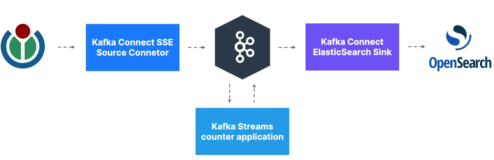

# Apache Kafka v3
## Case of study of Kafka Properties
### Use case:


### Request
- Docker
- Docker-compose
- Java 11
- Gradle
- Using Intellij

### Open dashboard Conduktor Console
````
http://localhost:8080/console
````
### Open the dashboard of OpenSearch
````
http://localhost:5601/app/dev_tools#/console
````